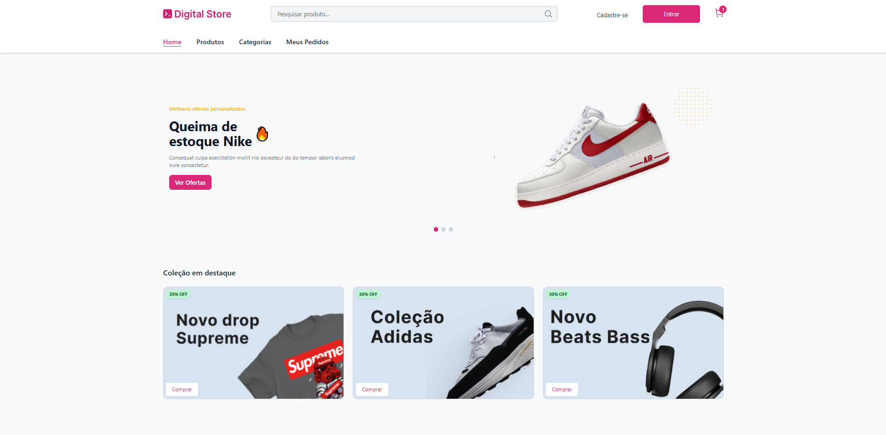
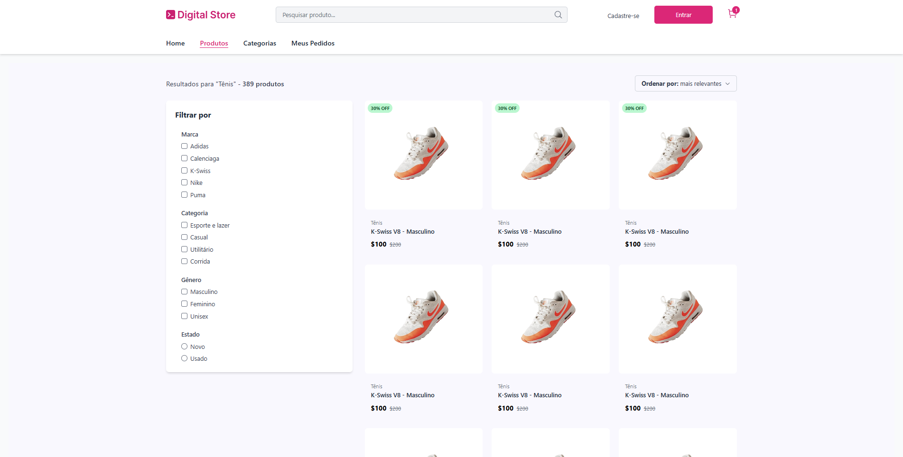
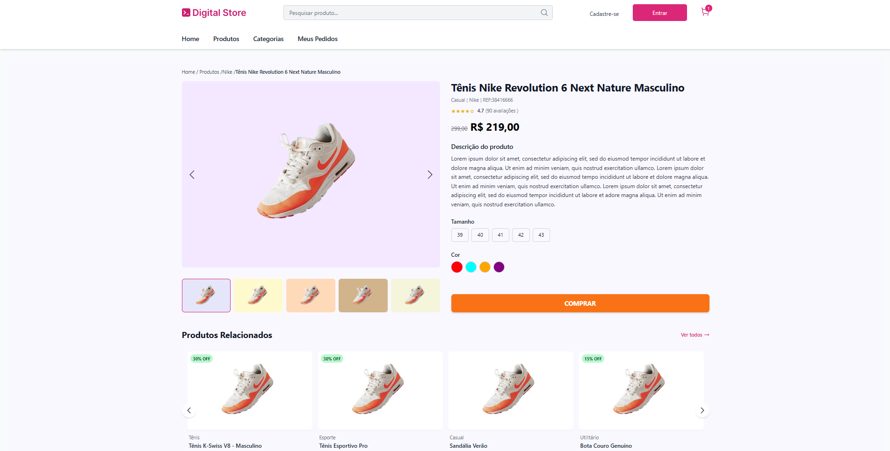
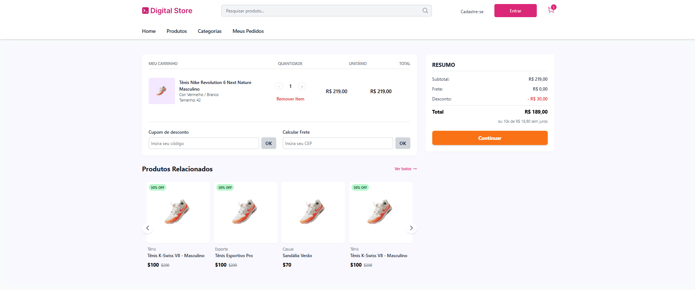
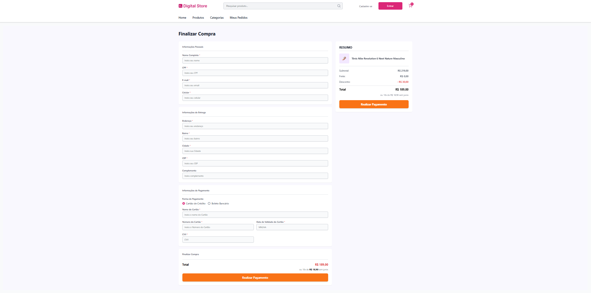

<div align="center">

#  Digital Store

### Plataforma de E-commerce desenvolvida com React, Vite e Tailwind CSS


</div>

---

#  Sobre o Projeto

O **Digital Store** é uma aplicação Front-end que simula uma plataforma de comércio eletrônico voltada para a venda de roupas, calçados e acessórios.

Este projeto foi desenvolvido em equipe durante um **curso de Desenvolvimento Full Stack**, como parte de um desafio prático voltado à construção de aplicações web modernas. Nesta etapa do curso, o foco esteve no desenvolvimento Front-end utilizando **React**, **Vite** e **Tailwind CSS**.

Durante o desenvolvimento foram aplicados conceitos como componentização, reutilização de componentes, organização da estrutura do projeto, navegação com React Router DOM e criação de interfaces responsivas, seguindo boas práticas de desenvolvimento.

---

#  Destaques

- Interface moderna e responsiva
- Arquitetura baseada em componentes React
- Navegação entre páginas utilizando React Router DOM
- Componentes reutilizáveis
- Organização modular do código
- Desenvolvimento colaborativo em equipe
- Aplicação desenvolvida como desafio prático de um curso Full Stack

---

# 🚀 Funcionalidades

- Catálogo de produtos
- Página de detalhes do produto
- Produtos relacionados
- Carrinho de compras
- Resumo da compra
- Navegação entre páginas
- Interface responsiva
- Componentes reutilizáveis

---

#  Tecnologias Utilizadas

## Front-end

- React
- Vite
- JavaScript (ES6+)
- Tailwind CSS
- React Router DOM
- HTML5
- CSS3

## Ferramentas

- Git
- GitHub

---

#  Estrutura do Projeto

```text
src
├── assets
├── components
├── pages
├── routes
├── services
├── styles
├── App.jsx
└── main.jsx
```

---

#  Capturas de Tela

## Página Inicial

<p align="center">

</p>

---

## Catálogo de Produtos

<p align="center">

</p>

---

## Página do Produto

<p align="center">

</p>

---

## Carrinho de Compras

<p align="center">

</p>

---

## Resumo da Compra

<p align="center">

</p>

---

#  Objetivos do Projeto

O principal objetivo deste projeto foi consolidar conhecimentos adquiridos durante o curso de Desenvolvimento Full Stack, aplicando conceitos fundamentais do desenvolvimento Front-end, tais como:

- Componentização com React
- Organização de aplicações escaláveis
- Gerenciamento de rotas
- Desenvolvimento de interfaces responsivas
- Reutilização de componentes
- Versionamento de código com Git e GitHub
- Trabalho colaborativo em equipe

---

#  Aprendizados

Durante o desenvolvimento deste projeto foram aprimoradas habilidades em:

- React
- JavaScript Moderno (ES6+)
- React Router DOM
- Tailwind CSS
- Organização de projetos Front-end
- Componentização
- Responsividade
- Git e GitHub
- Desenvolvimento colaborativo

---

#  Equipe

- José Kawam Rodrigues da Silva
- Antônio Mathyas Santos da Silva
- Iarlei Ferreira de Barros
- Nirla Maria dos Santos

---

#  Contexto

Este projeto foi desenvolvido para fins educacionais como parte das atividades práticas de um curso de **Desenvolvimento Full Stack**. O desafio consistiu em construir uma aplicação Front-end inspirada em uma plataforma de e-commerce, aplicando boas práticas de desenvolvimento, organização de código e trabalho em equipe.

---

<div align="center">

###  Obrigado por visitar este repositório!

Caso tenha gostado do projeto, considere deixar uma estrela no repositório.

</div>
